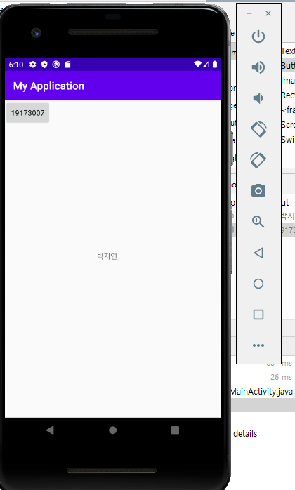
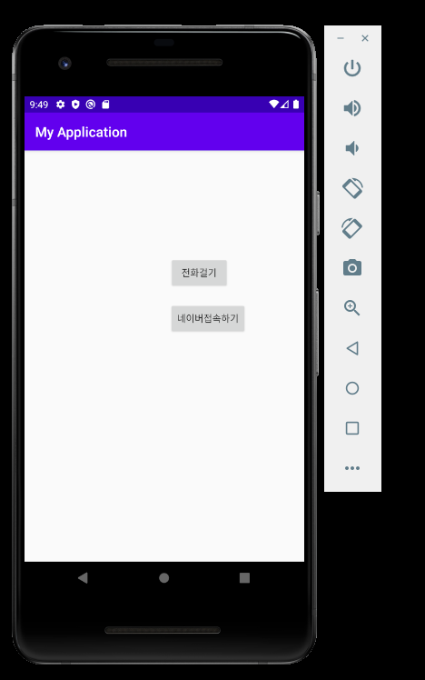
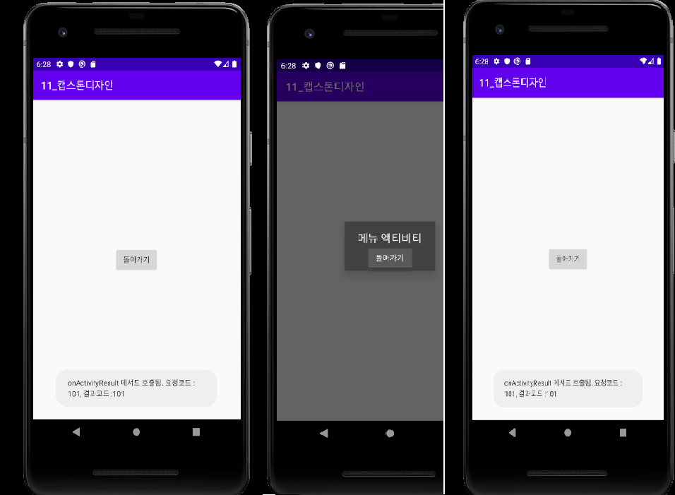

#19173007 박지연

##2주차  과제 
  </img>
##3주차  과제
  </img>

##4주차 과제
  :배달비와 최소주문금액 부담을 줄여주는 "배달공유어플"
 -같은 주택에 사는 사람들끼리 미리 점심이나 저녁 메뉴를 예고해서 띄워놓은 후
 그 메뉴가 맘에 드는 사람들끼리 모여서 배달료를 n분의 1로 계산한 후 각자 시킨 음식을 가져가는 시스템으로 
 최소주문금액과 배달료 부담을 줄여주는 어플이다.
 
 
 ## 10주차 과제 
   </img>

 
 ##11주차 과제
   </img>
